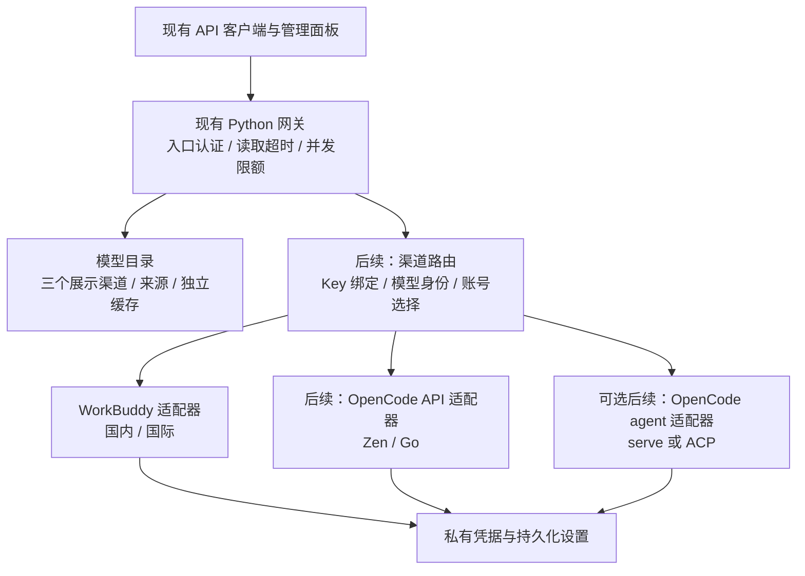

# WorkBuddy 与 OpenCode 逐步整合方案

日期：2026-10-07。用户选择继续使用现有 Python + Docker / 1Panel 部署，逐步整合。本文区分本分支已实现的能力与后续设计；来源和 issue 证据见 [OpenCode 调研](research/opencode-free-gate.md)。

## 当前交付

| 能力 | 状态与边界 |
| --- | --- |
| 两个上游 | 本地配置 `upstream-workbuddy`、`upstream-opencode`，自己的 fork 为 `origin`；固定来源记录在 [upstreams.json](../upstreams.json)。 |
| 三个模型渠道 | 模型页可选 OpenCode、WorkBuddy 国内、WorkBuddy 国际，浏览器保存选择；切换不修改网关默认出口、账号绑定或 API Key 绑定。 |
| OpenCode 目录 | 从官方 Zen 目录取真实 ID，Models.dev 的 `opencode` provider 补充价格、规格和能力；保留 `-free` 后缀。无法获取实时目录时可使用明确标注来源的元数据目录。 |
| 缓存与失败 | OpenCode 独立缓存至 `accounts/catalogs/opencode.json`，5 分钟有效，失败后短期节流；旧缓存显示过期提示，没有目录时显示失败并清空旧行。记录来源和更新时间，文件权限沿用私有存储。 |
| OpenCode 推理 | 尚未接入。目录响应明确返回 `catalogue_only: true`、`inference_ready: false`，页面提示接入状态。目录存在、零标价均不是账号调用验证。 |
| WorkBuddy 账号迁移 | 修复导入丢失 `product`、`proxySlot`、旧 `proxy`、`addedAt` 的问题，覆盖导出→导入→落盘重载。旧版本字段、格式和凭据校验继续支持。 |

旧 `/v1/models` 没有 `channel` 参数时仍按原来的 Key / realm 规则返回 WorkBuddy 目录。新增查询参数为 `channel=opencode`、`channel=workbuddy-cn`、`channel=workbuddy-intl`，仅控制目录。显式选择渠道可浏览其他目录，调用时仍执行原有 Key 权限与区域规则。

## 上游维护

| remote | 地址 | 用途 |
| --- | --- | --- |
| `origin` | `https://github.com/Albert-Li-Sz/workbuddy2api-hub.git` | 自己的整合项目与发布分支。 |
| `upstream-workbuddy` | `https://github.com/ardeyouxipianyi/workbuddy2api-hub.git` | WorkBuddy 修复、功能与发布更新。 |
| `upstream-opencode` | `https://github.com/GuJi08233/opencode-free-gate.git` | OpenCode 反代的协议、问题和实现思路参考。 |

新 checkout 的 remote 不会随文件自动安装，可按清单配置：

```bash
git remote add upstream-workbuddy https://github.com/ardeyouxipianyi/workbuddy2api-hub.git
git remote add upstream-opencode https://github.com/GuJi08233/opencode-free-gate.git
git fetch upstream-workbuddy main
git fetch --no-tags upstream-opencode main
```

现有 checkout 已完成配置，无需再次执行 `remote add`。WorkBuddy 更新在整合分支审阅后选择性合入，保留已有 MIT 许可和来源记录。OpenCode Go 项目的历史与 Python 项目无关，采用协议参考和独立适配实现，不合并无关历史。已核查的 Go 源码缺少许可正文，因此本分支没有复制其源码；官方 API 文档和接口作为新适配器的契约。

不要把上游分支作为日常提交目的地。来源更新后重新检查主线、未合并 PR 和官方限制，并更新清单中的已审阅提交；PR 作者的可用性描述需要独立验证。

## 渐进架构

当前只新增 `wb_opencode_catalog.py`，不拆改既有 WorkBuddy 推理链。等第二个推理适配器真正接入，再把公共认证、模型身份和协议边界从 `wb_proxy.py` 提取出来。



公共适配器暴露小接口：列出模型、检查凭据、发送原生请求、取消请求、归一错误。WorkBuddy 的 JWT 刷新、积分与签到留在 WorkBuddy 模块；Zen / Go 的 Key 与计费状态留在 OpenCode 模块；agent 的进程、会话与工具权限留在 agent 模块。面板不用了解这些协议内部字段。

内部模型身份采用 `(provider, mode/realm, upstream_model_id)`，同名 DeepSeek 模型不能跨渠道合并额度、能力、冷却和价格。外部旧模型 ID 保持兼容；新增渠道优先通过 API Key 的显式渠道绑定选择，必要时引入带渠道的模型别名，并在页面展示其真实上游 ID。

## OpenCode 新接入方式

正式 API 模式使用官方稳定入口 `https://opencode.ai/zen/v1` 与 `https://opencode.ai/zen/go/v1`，接受真实 API Key。`oc_sk_` 是官方新 Console key 的一种形态，但校验不要硬编码前缀，也不要套用 WorkBuddy JWT 解析器。官方内部迁移目标不是可自行替换的公开 base URL。[Zen 文档](https://opencode.ai/docs/zen/)、[Go 文档](https://opencode.ai/docs/go/)

模型所属渠道与下游协议分别处理。按官方模型协议优先透传 Chat Completions、Responses 或 Messages；需要转换时，单独验证 tools 格式、tool_choice、流事件、usage、错误和取消，不能统一注入下游未声明的 bash/read，也不能把不支持的协议静默降级。

入口 API Key、管理面板登录、上游 Zen / Go Key 是三种凭据。上游 Key 不直接使用客户端入口 Key；认证失败、免费层限制、区域拒绝、配额耗尽与网络错误分别分类。401 标记凭据问题；403 保留具体原因；429 尊重 Retry-After；账号固定出口继续适用，不把换 IP 当权限或额度恢复方式。

该 Go 仓库关闭了 Issues，新的相关尝试在未合并 PR #3 中；官方维护者明确外部 harness 不支持免费层。当前方案采用真实 Key 的正式接口，完整 OpenCode agent 作为独立可选模式，后者不承诺透明模型代理语义或免费模型可用性。[PR #3](https://github.com/GuJi08233/opencode-free-gate/pull/3)、[维护者说明](https://github.com/anomalyco/opencode/issues/49621#issuecomment-5723383322)

## 部署兼容约束

| 现有部署 | 整合要求 |
| --- | --- |
| 本机 Python 3.9+ | 保持标准库启动，不为目录或正式 API 接入增加 Go / Bun 必需运行时。 |
| Windows / macOS / Linux 启动脚本 | 保留 `.bat`、`.command`、`.sh` 的启动参数和端口习惯；跨平台测试持续覆盖旧启动方式。 |
| Docker / 1Panel | 保持默认 8788、当前 `HOST` / `PORT` / `API_KEY` / `TZ` 与 `WB_*` 配置，保持健康检查和 API Key 保护。 |
| 数据卷 | 继续挂载 `/app/accounts`、`/app/usage`；新增目录缓存归入 accounts 子目录，不把缓存当账号扫描。 |
| 运行用户 | 保留当前 Compose `PUID` / `PGID` 配置和可写卷要求；凭据目录 0700、文件 0600（POSIX）。 |
| 旧 API 客户端 | 保留现有 `/v1` 接口、模型 ID、Key 模型限制、默认出口与区域绑定；新增功能显式启用。 |
| 可选 agent 服务 | 后续独立容器 / 子进程模式，明确 OpenCode 版本、独立工作目录、生命周期、权限与服务认证，不能因切换目录自动启动。 |

当前 Dockerfile 已通过 `COPY wb_*.py dashboard.html ./` 包含新的目录模块，基础镜像与入口无需更改。发布自己镜像后再更新部署镜像地址；当前上游 `latest` 镜像不会自动包含本地整合改动。amd64 / arm64 镜像、1Panel 导入和实际数据卷升级留到发布阶段验收。

## 账号导入导出

现有 `workbuddy-accounts` / `version: 1` 继续作为默认导出格式，数组、单行对象、桌面嵌套结构、cockpit snake_case 均继续导入。API / UI 的 dry-run、重复跳过和覆盖选项保留。

这次修复保留出站产品身份、代理槽位 ID、旧代理 URL 和添加时间。代理槽位引用在目标机器按目标设置解析；账号导出不包含槽位配置本身，所以只迁移账号时需要同步同 ID 的槽位，或显式重绑。迁移不会把运行时解析得到的代理 URL当作原始配置写回。

旧“凭据导入”语义仍清空错误、冷却与积分缓存，并启用导入账号；覆盖已有账号时保留目标账号的原添加时间。后续“完整备份恢复”需单独提供，不能偷偷改变旧导入的行为。

后续备份 envelope 建议为 `format: workbody-backup`、`version: 1`，包含明确类型的 providers/accounts、settings、proxySlots 和 modelAliases；这是设计，当前没有新增此格式的导入接口。每个账号有 provider、mode/realm 和凭据类型，WorkBuddy JWT、OpenCode API Key、Server Basic Auth 分别存储。

导入 OpenCode 的官方 `auth.json` 时只提取用户选择的 `opencode` / `opencode-go` API provider；它是 provider map，不是多账号数组。未知 provider、OAuth / wellknown 认证不得自动转成 Zen Key。后续格式支持预览、版本校验、冲突列表、代理引用重映射、重复策略和事务回滚，全部通过后才原子提交；不能部分写入后声称完成。

完整备份保留启用状态、固定出口和持久化限制，重建运行中的并发计数、冷却、任务租约和面板会话。脱敏导出用于检查，不视为可恢复备份。新旧凭据均继续使用私有原子写入，不能进入 Git、普通日志或截图。

## 实施与验收

| 阶段 | 状态 | 交付与验收 |
| --- | --- | --- |
| 0. 上游与调研 | 已完成 | 固定来源、检查 main / PR / 官方 issue，记录实际限制与新 key / agent 路径。 |
| 1. 目录与迁移基础 | 本分支实现 | 三渠道选择；快速切换无旧响应覆盖；刷新后记住选择；缓存失效与失败提示；WorkBuddy 导出导入重载保留配置。 |
| 2. 正式 API 账号 | 待实现 | Zen / Go 的真实 Key 配置、类型化存储、定向 auth.json 导入、兼容导出与 Key 渠道绑定。 |
| 3. 推理协议 | 待实现 | 按模型原生协议完成流式 / 非流式回答、工具、usage、取消和错误传播；使用已授权有效账号验证完整回答。 |
| 4. agent 可选模式 | 按需求实现 | serve / ACP 的会话、进程、工具权限、独立工作目录、取消与清理，按部署版本的 API spec 验收。 |
| 5. 发布兼容性 | 待实现 | Python 最低版本与 Windows CI、amd64 / arm64 镜像、1Panel、本机启动、卷升级 / 回滚和完整备份恢复。 |

本分支增加了离线目录、HTTP 路由、异步切换和账号迁移回归测试，统一入口仍为 `python tests/run_all.py`。本机完整测试与浏览器验收验证当前实现；目录抓取成功不等于推理成功，未做真实 OpenCode 账号调用。升级前备份 accounts / usage，回滚应用时保留原有卷，新增目录缓存可丢弃并重新抓取。
